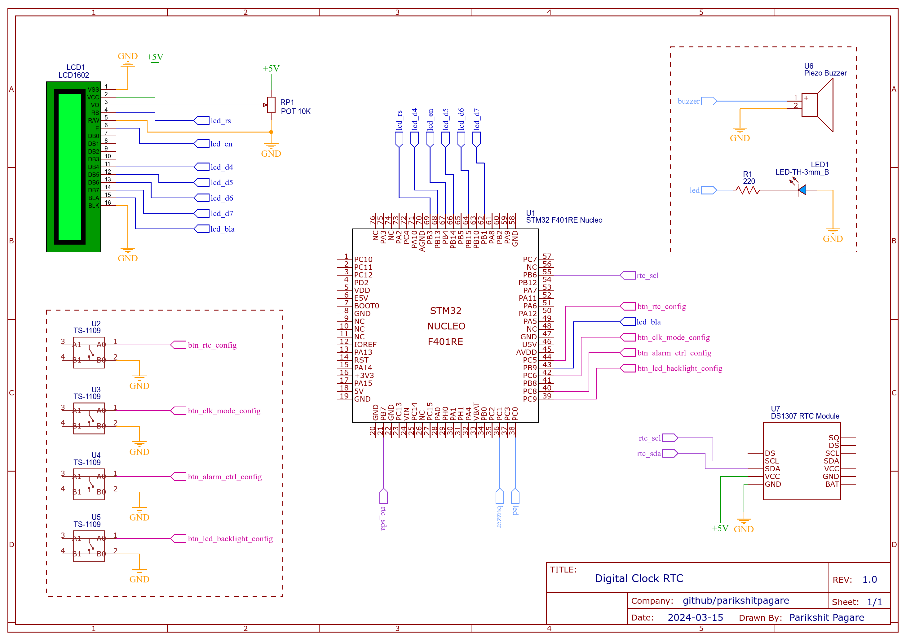

   
   
   

A digital clock and calendar with alarm functionality developed on STM32 F401 (ARM Cortex M4) microcontroller using DS1307 RTC for time keeping. It includes a LCD based user interface to set time, date and alarm using interrupt based multiple push buttons.

 

# Features

- 4 Push buttons to configure and control the system.
- Updated clock and calendar using DS1307 RTC and timer interrupt.
- User configurable clock modes to switch between 12h and 24h with instant time conversion.
- Clock, Calendar and Alarm setting in both clock modes.
- Alarm indicator using Led and Buzzer.
- Automated as well as button based manual control to stop alarm.
- LCD back light control using button.

# Hardware

## Requirements

- STM32 F401 Nucleo Microcontroller
- DS1307 RTC Module
- Character LCD 16x2
- Potentiometer 10K
- Push Buttons
- Led
- Buzzer

## Schematic

	

