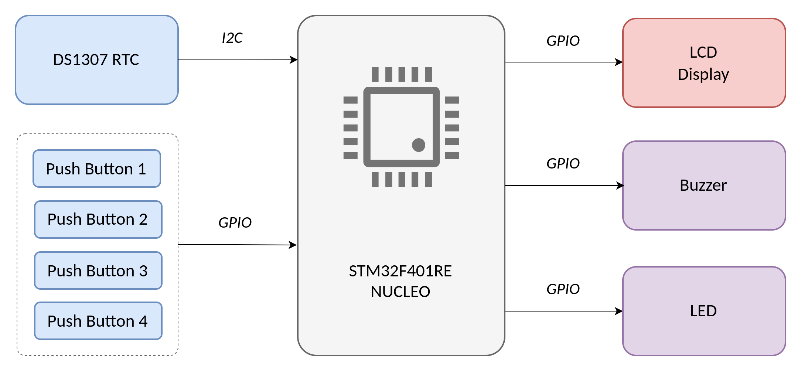
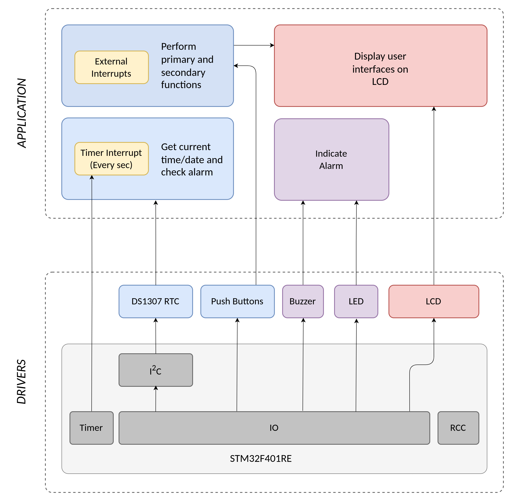

   
   
   

A digital clock and calendar with alarm functionality developed on STM32F401 (ARM Cortex-M4) microcontroller using DS1307 RTC for time keeping. It includes a LCD based user interface to set time, date and alarm using interrupt based multiple push buttons.

 

	

# Features

- 4 Push buttons to configure and control the system.
- Updated clock and calendar using DS1307 RTC and timer interrupt.
- User configurable clock modes to switch between 12h and 24h with instant time conversion.
- Clock, Calendar and Alarm setting in both clock modes.
- Alarm indicator using Led and Buzzer.
- Automated as well as button based manual control to stop alarm.
- LCD back light control using button.

# System Overview

 

	

	Overview

 

	

	Software Architechture

# Hardware

## Requirements

- STM32 F401 Nucleo Microcontroller
- DS1307 RTC Module
- Character LCD 16x2
- Potentiometer 10K
- Push Buttons
- Led
- Buzzer

## Schematic

	

# Software

To program the STM32F401xx microcontroller **STM32Cube IDE** is used without using the auto generated code. The purpose of using the CubeMX software is to generate the required HAL peripheral drivers for this application. The rest of the code is written manually.

In this application following Peripheral Drivers are used,

<table>
  <tr>
    <th>HAL Drivers</th>
    <th>Description</th>
  </tr>
  <tr>
    <td>stm32f4xx_hal_rcc</td>
    <td>Implement the HSI clock and reset the peripherals.</td>
  </tr>
  <tr>
    <td>stm32f4xx_hal_gpio</td>
    <td>Implement GPIO related features for external components.</td>
  </tr>
  <tr>
    <td>stm32f4xx_hal_i2c</td>
    <td>Implement I2C protocol for DS1307 RTC.</td>
  </tr>
    <tr>
    <td>stm32f4xx_hal_timer</td>
    <td>Implement timer interrupt to fetch current time and date.</td>
  </tr>
</table>

 

The external components are integrated with the microcontroller by developing the required device drivers.

<table>
  <tr>
    <th>Device Drivers</th>
    <th>Description</th>
  </tr>
  <tr>
    <td>rtc_ds1307</td>
    <td>Implement I2C communication between RTC and STM32 .</td>
  </tr>
  <tr>
    <td>lcd</td>
    <td>Integrate LCD with STM32.</td>
  </tr>
  <tr>
    <td>push_buttons</td>
    <td>Implement GPIO interrupts for controlling the system.</td>
  </tr>
    <tr>
    <td>led</td>
    <td>Integrate LED for alarm functionality.</td>
  </tr>
  </tr>
    <tr>
    <td>buzzer</td>
    <td>Integrate Buzzer for alarm functionality.</td>
  </tr>
</table>

 

# Implementation

## Push Buttons Implementation

The system is controlled and configured using 4 push buttons each of them having different functionality.

	

### Button 1: RTC Configure Button

- This button is used to toggle between different user interfaces on LCD to set the clock, calendar and alarm. 
- When the setting is completed the button returns back the main interface on LCD.

### Button 2: Clock Mode Button

#### Primary Function
- Toggle the clock mode mode between 12h and 24h formats.

#### Secondary Function

- Set am/pm status of clock & alarm in 12hr clock mode.
- Set the day of the week.

### Button 3: Alarm Control Button

#### Primary Function
- Stop the alarm when ringing.
- Enable/ Disable alarm (Alarm will not ring when disabled).

#### Secondary Function

- Set the hours value of the clock & alarm.
- Set the date of calendar.

### Button 4: LCD Backlight control

#### Primary Function
- Enable/ Disable backlight of the LCD.

#### Secondary Function

- Set the minutes value of the clock & alarm.
- Set the month of calendar.

## LCD Display Implementation

### Main Interface

The main interface displays following characteristics,

	

- Clock mode which displays either **'24h>'** in 24h format or **'am/pm'** in 12h format.
- Ticking time in **'hh:mm:ss'** format.
- Calendar in **'day dd/mm'** format.
- Alarm enable/disable indicator which displays **'AL>'** when enabled.

### Secondary Interfaces

#### Set Clock

- This interface enables the user to set the hours and mins value.
- If the clock mode is 12h then there is an option to toggle between am/pm.

	

#### Set Calendar

- This interface enables the user to set the day, date and week.
  

	

#### Set Alarm

- This interface enables the user to set the hours and mins value.
- If the clock mode is 12h then there is an option to toggle between am/pm.
- It remembers the previous set values enabling the user to know the exact time the alarm is set on.

	

## Alarm Implementation

- To indicate the alarm, a buzzer and led is integrated which toggles on and off every second until the alarm stops.
- The alarm will stop automatically after 30sec or it can be stopped manually by using the dedicated push button.

	

# Working 

## DS1307 RTC For Time Keeping

The most important part of the clock is keep track of the time and date once the they are set by the user. 

For this purpose an external RTC module DS1307 is integrated with the microcontroller using Inter-Integrated Circuit (I2C) communication protocol. 

I2C operates in 2 modes – Master mode and Slave Mode. In this application, STM32F401 acts as the master and DS1307 is the slave.The slave and master are connected using SDA and SCL lines where,

- SDA (Serial Data) : Used to read from and write to the required addresses of the DS1307 RTC module.
- SCL (Serial Clock) : Carries the clock signal based on which data transfer takes place.

 

This project makes use of STM32 HAL I2C drivers for I2C implementation. The API's used are as follows,

<table>
  <tr>
    <th>HAL API</th>
    <th>Description</th>
  </tr>
  <tr>
    <td>HAL_I2C_Mem_Write</td>
    <td> Write 1 byte data to a particular address of the RTC.</td>
  </tr>
  <tr>
    <td>HAL_I2C_Mem_Read</td>
    <td>Read 1 byte data from a the particular address of the RTC</td>
</table>

 

A driver for the RTC module is developed to expose following different API's for easy implementation by the user,

<table>
  <tr>
    <th>Driver API </th>
    <th>Description</th>
  </tr>
  <tr>
    <td>rtc_ds1307_init</td>
    <td>Initialize the RTC module.</td>
  </tr>
  <tr>
    <td>rtc_ds1307_set_time</td>
    <td> Set the time and clock mode (12h/24h).</td>
  </tr>
   <tr>
    <td>rtc_ds1307_get_time</td>
    <td>Get the current time and clock mode (12h/24h)..</td>
  </tr>
   <tr>
    <td>rtc_ds1307_set_cal</td>
    <td>Set the day, date, month and year.</td>
  </tr>
   <tr>
    <td>rtc_ds1307_get_cal</td>
    <td>Get the curren day, date, month and year.</td>
  </tr>
</table>

The current time and date are fetched from RTC using timer interrupt which triggers every 1 sec.

## LCD Integration

A driver for the LCD Display is developed according to the datasheet to expose following different API's for easy implementation by the user,

<table>
  <tr>
    <th>Driver API </th>
    <th>Description</th>
  </tr>
  <tr>
    <td>lcd_init</td>
    <td>Initialize the LCD display.</td>
  </tr>
  <tr>
    <td>lcd_send_command</td>
    <td> Send instructions to the LCD according to the datasheet.</td>
  </tr>
   <tr>
    <td>lcd_send_data</td>
    <td>Send data to the LCD.</td>
  </tr>
   <tr>
    <td>lcd_print_string</td>
    <td>Display characters/strings on LCD .</td>
  </tr>
   <tr>
    <td>lcd_ctrl_backlight</td>
    <td>Control LCD backlight.</td>
  </tr>
</table>

 

The following LCD command API's are exposed to the user,

<table>
  <tr>
    <th>LCD Command API </th>
    <th>Description</th>
  </tr>
  <tr>
    <td>lcd_display_clear</td>
    <td>Clear the display.</td>
  </tr>
  <tr>
    <td>lcd_display_return_home</td>
    <td>Shift display to original position.</td>
  </tr>
   <tr>
    <td>lcd_entry_mode_set</td>
    <td>Sets cursor move direction and specifies display shift.</td>
  </tr>
   <tr>
    <td>lcd_display_on</td>
    <td>Set the dsiplay to be on.</td>
  </tr>
   <tr>
    <td>lcd_display_off</td>
    <td>Set the display to be off.</td>
  </tr>
  </tr>
   <tr>
    <td>lcd_display_on_cursor_on</td>
    <td>Set the cursor to be on.</td>
  </tr>
  </tr>
   <tr>
    <td>lcd_display_on_cursor_off</td>
    <td>Set the cursor to be off.</td>
  </tr>
  </tr>
   <tr>
    <td>lcd_display_on_blink_on</td>
    <td>Set the blink to be on.</td>
  </tr>
  </tr>
   <tr>
    <td>lcd_display_on_blink_off</td>
    <td>Set the blink to be off.</td>
  </tr>
  </tr>
   <tr>
    <td>lcd_function_set</td>
    <td> Sets interface data length, number of display lines and character font.
</td>
  </tr>
  </tr>
   <tr>
    <td>lcd_set_cursor</td>
    <td>Sets the cursor position to particular row and column.</td>
  </tr>
</table>

## External Interrupt Based Push Button System

To configure the different parameters like clock, calendar and alarm push buttons are implemented using the EXTI (External Interrupts) for faster and accurate response.

Since the timer interrupt executes every sec, it is required to get instant response from the button which cannot be done by simple polling mechanism. 

The interrupt based system works accurately with almost no delay giving instant response when the button is pressed.

## Creator

**Parikshit Pagare**

